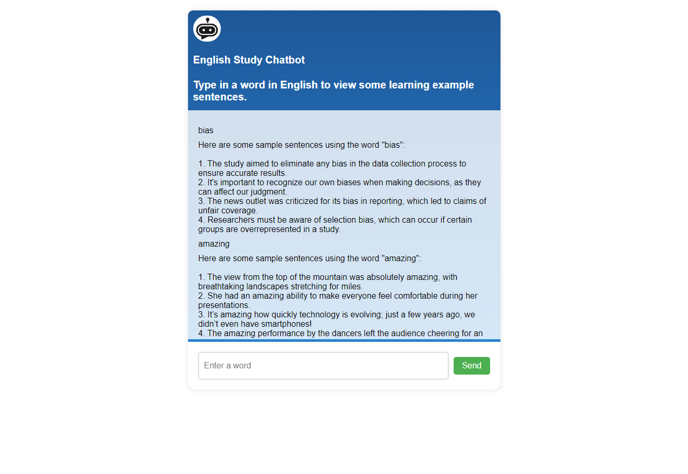

# English Learning Chatbot

This is a simple chatbot built with Node.js that leverages the OpenAI API to help users learn English. Users can input a word, and the chatbot will provide definitions, example sentences, and explanations to assist in learning English vocabulary.

## Features

- **Word Definition**: Provides a detailed definition of the input word.
- **Example Sentences**: Generates sentences using the word to showcase its usage.
- **Word Explanation**: Offers additional context and explanations to aid in understanding.

## Technology Stack

- **Node.js**: The core runtime for executing the bot.
- **OpenAI API**: Used to process word definitions, explanations, and generate example sentences.
- **dotenv**: For managing environment variables securely.

## Setup

### Prerequisites

- [Node.js](https://nodejs.org/) installed
- An OpenAI API key. You can get this by signing up at [OpenAI](https://beta.openai.com/signup/).

### Installation

1. Clone the repository:

   ```bash
   git clone https://github.com/NYC-WebWorks/english-learning-chatbot.git
   ```

2. Navigate to the project directory:

   ```bash
   cd english-learning-chatbot
   ```

3. Install dependencies:

   ```bash
   npm install
   ```

4. Create a `.env` file in the project root and add your OpenAI API key:

   ```plaintext
   OPENAI_API_KEY=your-api-key-here
   ```

5. Start the application:

   ```bash
   npm start
   ```

The chatbot will be running on `http://localhost:3000`.

## Usage

To interact with the chatbot:

1. Open your terminal.
2. Run the app using `npm start`.
3. Input a word and the chatbot will respond with a definition, example sentences, and an explanation to help you learn how to use the word in English.

## Screenshot



## Contributing

If you'd like to contribute to this project, feel free to fork the repository and submit a pull request.

1. Fork the repo
2. Create your feature branch: `git checkout -b feature/YourFeature`
3. Commit your changes: `git commit -m 'Add YourFeature'`
4. Push to the branch: `git push origin feature/YourFeature`
5. Open a pull request


## License

This project is licensed under the GNU General Public License v3.0. You are free to modify, distribute, and use the software, as long as any modifications or derivative works are also licensed under the GPL.

See the [LICENSE](LICENSE) file for more details.

## Contact

If you have any questions or suggestions, feel free to reach out to [ireallyhateemailsxd@gmail.com].
